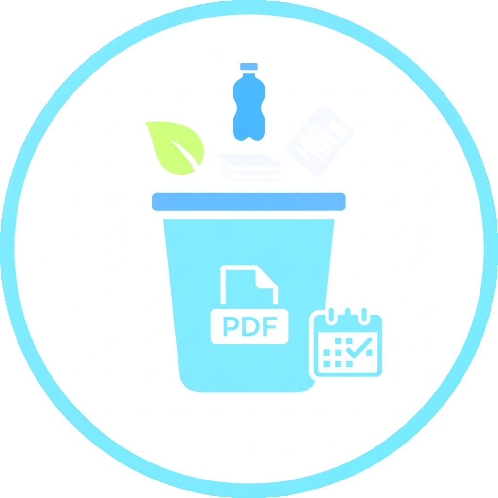

<!-- Logo (replace with your actual logo path) -->
<h1 style="display: flex; align-items: center; background-color: #f6f8fa; padding: 5px;">
  
  GarbageCalendar
</h1>

[](https://github.com/sikienzl/GarbageCalendar/actions/workflows/main.yml)

**GarbageCalendar** is a Java-based tool for creating and managing waste collection schedules for German municipalities. The current version provides core functionality for scheduling and exporting garbage collection calendars.

## ✨ Features

### Core Functionality
- **Year selection** for calendar creation
- **Daily garbage assignment** to specific waste types
- **Manual public holiday configuration** for accurate scheduling

### Export Options
- **PDF export** (grayscale version available)

### Upcoming Features (Planned)
- Autosave functionality
- Dedicated save button
- Color PDF export option

## 📦 Installation
1. Clone the repository:
   ```bash
   git clone https://github.com/sikienzl/GarbageCalendar.git
2. Ensure Java (JDK 11+) is installed
3. Build and run the project

## 🖥️ Usage
1. Launch the application
2. Select the target year
3. Assign garbage types to specific days
4. Configure public holidays manually
5. Export your calendar as PDF

## 🤝 Support & Donations
For questions or support, contact: <sikienzl.github@t-online.de>

💙 Support the project via bunq: [bunq](https://bunq.me/DEsikienzl)

## 🛠️ Contributing
Contributions are welcome! Please open an issue or submit a pull request.

📄 License
This project is licensed under the **[Apache License 2.0](https://www.apache.org/licenses/LICENSE-2.0.txt)**
